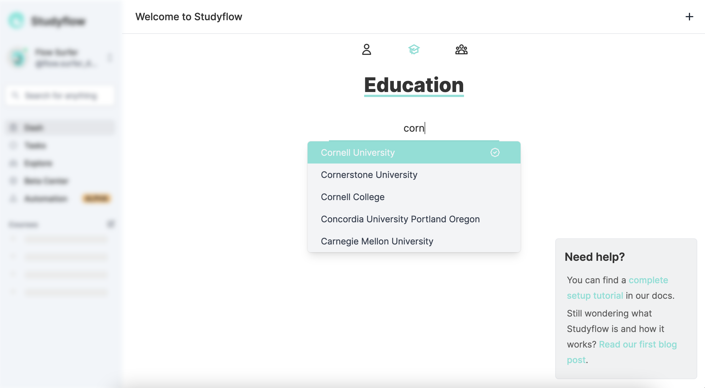
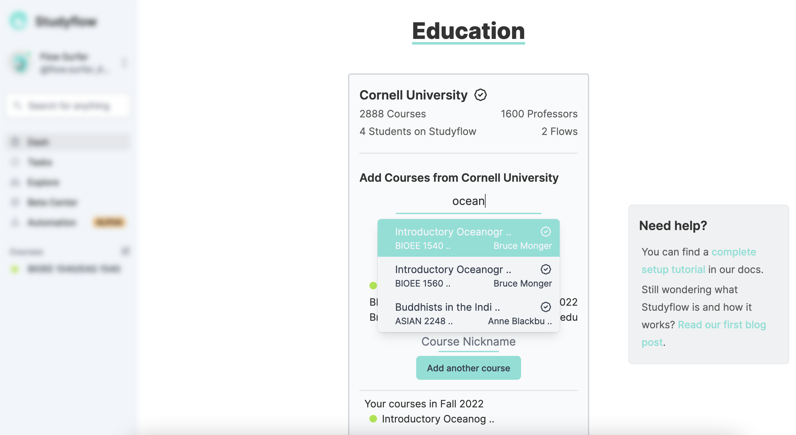

# Enter Your Education Details

Choose your school, create a term. and enter your courses.

## Educational Anatomy

On Studyflow, you first select your **school**. You can create many **terms** for that school (e.g., a semester). Each term has many **courses** which are the lowest level of categorization in Studyflow.

More on schools: a school is either **supported** or unsupported. If a school is supported, its course roster is actively updated. Currently, Cornell University is the only supported school. All 2,888 courses from Cornell's Fall 2022 semester are loaded into Studyflow.

## Selecting Your School

Use our search box to find your school. Studyflow has a total of 1903 colleges and universities to choose from. If you can't find your school, please [contact us](https://studyflow.ai/beta#contact).

## Creating a Term

If you have selected a supported school, a term will automatically be created for you. If not, simply select your term type (quarter, semester, trimester, or summer), and a term will be created.

## Selecting Your Courses

First, click add course to add a course to your term.

If you have selected a supported school, you will be able to search through all available courses for your school. Pick one. If you have not selected a supported school, enter your course names manually. We recommend entering the official course title, code, or both.

Select your course color. This will categorize everything. Don't worry, course colors can be changed later!

Finally enter a course nickname. This will be the name you see when you see the course on your dashboard. Try to keep it short! For example, CS 3410 Computer System Organization and Programming can be condensed down to 3410.

Rinse and repeat for each course you are taking this term, then click the I'm done adding courses button when you are finished!
