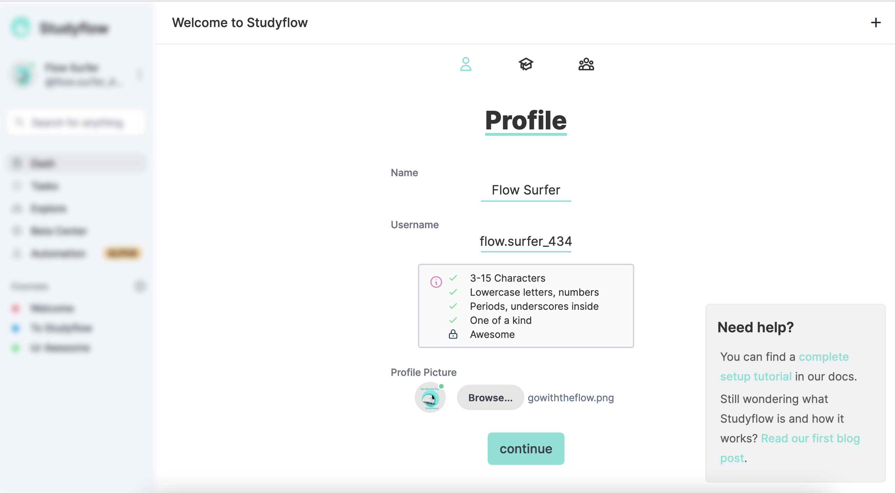

# Setup Your Profile

Welcome to the dashboard. This is where you can see flows, navigation, and upcoming items. It is currently locked (notice that the dashbar is blurred) and will unlock after you complete setup. Now let's enter your name, username, and (optional) profile picture.

## Name

Your name may be autofilled if you signed in with Google. Feel free to use a pseudonym if you like!

## Username

Your username must pass three checks:

- be 3-15 characters long
- be composed of lowercase letters and numbers
- periods and underscores are permitted, but they must be inside
- be unique amongst Studyflow students

## Profile Picture

You may optionally upload a profile image. Click the upload button and select any image file.
