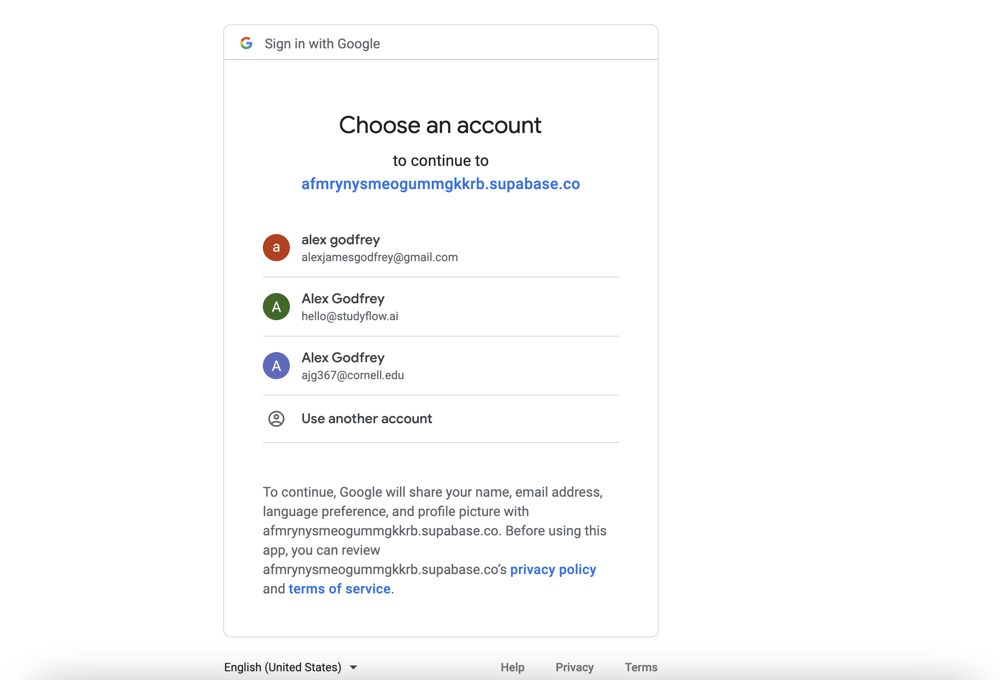

# Welcome to Studyflow

Let's discover **the power of Studyflow in less than 5 minutes**.

## Getting Started

Get started by **creating an account**. Visit the [homepage](https://studyflow.ai)
and click **Sign up** in the top right or go straight to the [login page](https://www.genome.gov/)
.


## Signing in with Google

Our current authentication provider is Google. Using Google helps us keep your information secure. This means that all you need is a Google account to create a Studyflow account! After clicking sign in with Google, select your Google account.



Don't worry about the weird URL. We have already contacted Google about it. Your're in the right place!

## Start your site

Run the development server:

```bash
cd my-website
npm run start
```

The `cd` command changes the directory you're working with. In order to work with your newly created Docusaurus site, you'll need to navigate the terminal there.

The `npm run start` command builds your website locally and serves it through a development server, ready for you to view at http://localhost:3000/.

Open `docs/intro.md` (this page) and edit some lines: the site **reloads automatically** and displays your changes.
